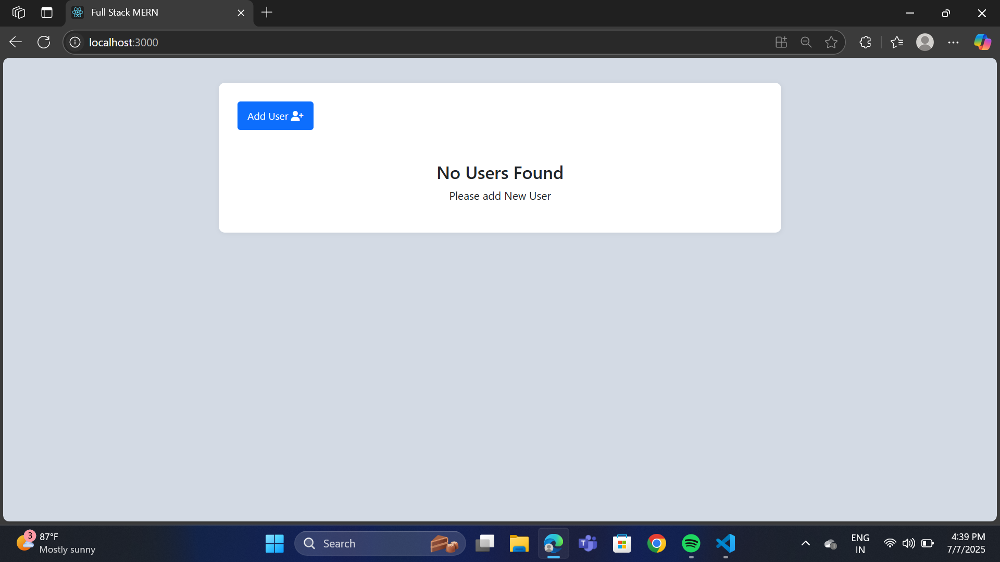

# 👥 MERN Stack User Management App

A fully responsive **User Management System** built with the MERN Stack (MongoDB, Express.js, React, Node.js). This app allows you to add, display, and delete users with a clean UI, mobile-friendly design, and toast notifications for real-time feedback.

---

## 📸 Preview

###  Mern-Stack

---

## 🧰 Tech Stack

✅ I added “Node.js + Express” to better reflect the full backend stack .
✅ “Toastify” is now clarified as React Hot Toast.

## ✨ Features

- ➕ Add new users with form validation
- 📋 View list of users in a responsive table
- 🗑 Delete users with confirmation
- 📱 Fully mobile-friendly UI
- 🚨 Real-time toast notifications
- 🎨 Responsive and modern layout using Flexbox and media queries

## 🙌 Contributing
Pull requests are welcome! For major changes, please open an issue first to discuss what you would like to improve.

